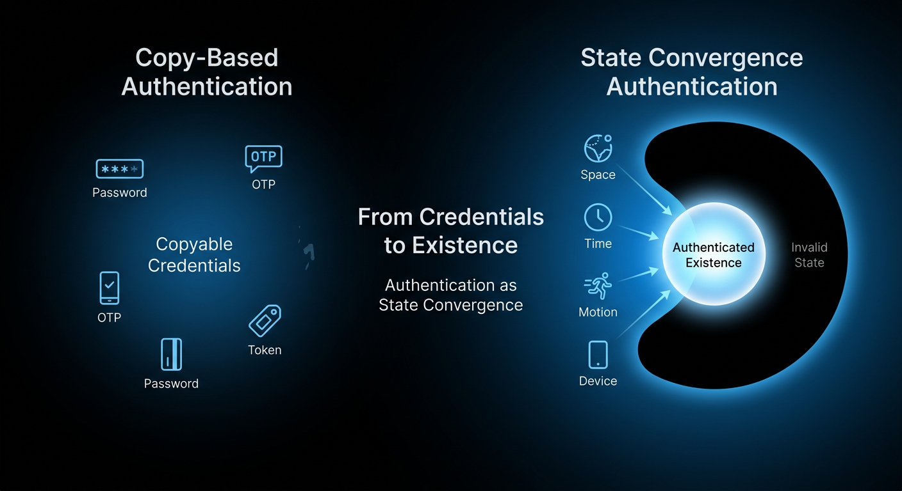

# GyroAuth  
**A GyroLogic Spin-off Project**

Security = Non-reproducibility of state

---

## 🧭 Overview

GyroAuth is a next-generation authentication concept that redefines identity verification as **multi-dimensional state convergence** across:

- Space (Location)
- Time
- Motion (Device behavior)
- Device-bound cryptographic identity

Instead of verifying *what you know*, GyroAuth verifies:

> **Where you are, when you are, and how you exist in that moment**

---

## 📊 Concept: From "Point" to "Dimension"

Traditional authentication relies on a static "point" (a password string). GyroAuth transforms this into a dynamic coordinate in multi-dimensional space.

Multi-Dimensional Password Rotation

In GyroAuth, your password ($K$) is not just a secret string; it acts as a Rotation Matrix $R(K)$.
The ambient environment data—Space ($S$), Time ($T$), and Motion ($M$)—are projected and rotated by your password to generate a unique, one-time authentication vector $V_{auth}$.

$$V_{auth} = R(K) \cdot \Phi(S, T, M)$$

Even if an attacker steals $K$, they cannot generate the correct $V_{auth}$ without being in your exact "Space-Time-Motion" coordinate.

---

## 🛡️ The Moment of Defense

GyroAuth creates a "Space-Time Wall" that physically and logically blocks unauthorized access, even with valid credentials.

Why It’s Unbreachable:

- Spatial Mismatch: A hacker in a different location cannot fulfill the spatial requirement ($S$).
- Temporal Mismatch: Because time ($T$) is a primary variable, stolen data expires in sub-seconds.
- Behavioral Mismatch: The unique "habit" of your device movement ($M$) adds a biometric layer of physics.

---

---

## 🧭 Trajectory Authentication

Authentication is not a single point in time.

It is a **sequence of states over time**.

### Why it matters

- A single state can be imitated  
- A trajectory requires **temporal consistency**  

Even if an attacker reproduces one moment:

→ They cannot reproduce the **entire path**

### Key Idea

> **Identity is not a state.  
> It is a trajectory.**

---

## 📡 Multi-Device Correlation

Authentication is not just identity.

It is **co-location**.

### Key Insight

> Authentication requires physical proximity.

### Why it matters

- Remote attacks fail by default  
- Devices must exist in the same space  

Even if credentials are stolen:

→ authentication fails without physical presence

---

## 🧠 About GyroLogic

GyroAuth is derived from the GyroLogic framework.

GyroLogic introduces a new paradigm:

- Truth = Stability-weighted projection  
- Meaning = Stabilized behavior  
- Inference = Dynamic convergence  

See the full theory:  
https://github.com/gitGyro-Dev/gyroos

---

## 🔗 Relationship to GyroLogic

GyroAuth is a **spin-off application** of the broader theoretical framework:

https://github.com/gitGyro-Dev/gyroos  

GyroLogic defines truth and evaluation as:

> **Observer-dependent convergence in a multi-dimensional space**

GyroAuth applies this concept to authentication:

- Traditional authentication → **static equality**
- GyroAuth → **dynamic state convergence**

---

## 🧠 Core Concept

Authentication is defined as:

Auth = Match( V_gyro(t), V_gyro_expected )

---

## 🧮 Core Model

V_gyro(t) = Π · R(K, T) · Φ(S, M)

---

## 🔐 Key Properties

- Replay-resistant  
- Phishing-resistant  
- Non-transferable  
- Physically constrained authentication  

---

## 🧩 Extended Concepts (Engineering Layer)

GyroAuth extends into practical system design through:

### ⏱ Dynamic Time Decay
Authentication validity rapidly decays over time.

→ Replay attacks become ineffective within sub-second windows.

---

### 📡 Multi-Device Correlation
Authentication depends on **relative proximity between devices**.

→ Example: PC + smartphone must exist in the same physical environment.

---

### 📱 Intentional Gesture Input
Authentication includes **physical device state during input**.

→ Password + motion/angle = dynamic authentication condition.

---

## 🚀 Use Cases

- Financial transactions  
- Data center operations  
- Critical infrastructure  
- Medical systems  

---

## 🧪 Project Scope

This repository contains:

- Concept definition  
- Mathematical model  
- Architecture design  
- PoC design  
- Engineering extensions  

⚠️ This is NOT a production SDK  
This is a **protocol and design layer**

---

## 📂 Documentation

- Theory Note → ./docs/theory-note.md  
- Authentication Region (Ω) → ./docs/omega.md  
- Non-Reproducibility → ./docs/non-reproducibility.md  
- Trajectory → ./docs/trajectory.md  
- Scoring → ./docs/scoring.md  

### Engineering

- Time Decay → ./docs/time-decay.md  
- Multi-Device → ./docs/multi-device-correlation.md  
- Gesture → ./docs/intentional-gesture.md  

---

## 📜 License & Usage

This repository publicly discloses the concept and architecture.

Commercial usage, implementation, or licensing:

👉 Requires separate agreement

---

## 📌 Citation

DOI: https://doi.org/10.5281/zenodo.19428071  
DOI: https://doi.org/10.5281/zenodo.19433740  

---

## 🌐 Vision

Authentication is no longer about secrets.

> **Authentication is the convergence of existence in space-time**

---

## 🤝 Collaboration / Inquiry

Interested in applying GyroAuth or GyroLogic?

We are open for:

- PoC design  
- Architecture consulting  
- Licensing discussions  

👉 Please open an issue:  
https://github.com/gitGyro-Dev/gyroauth/issues
