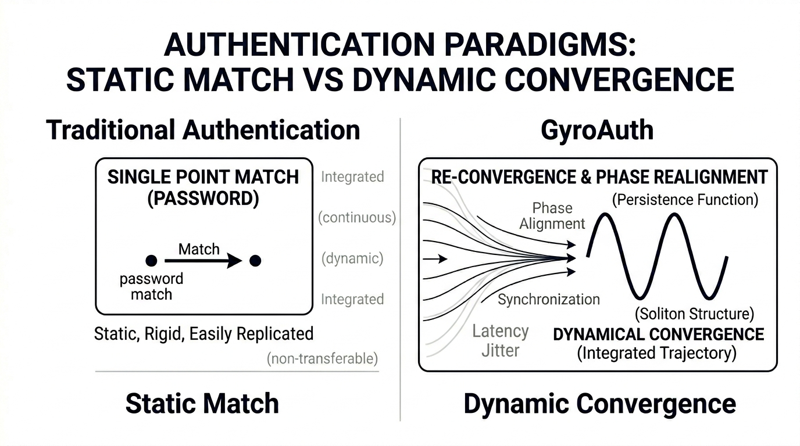
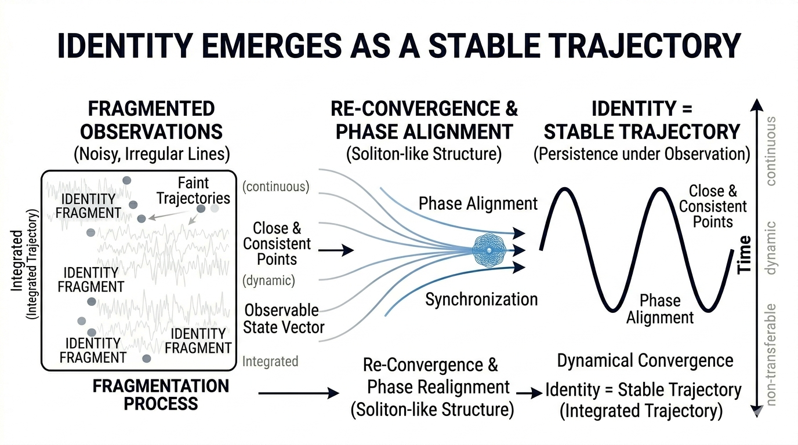
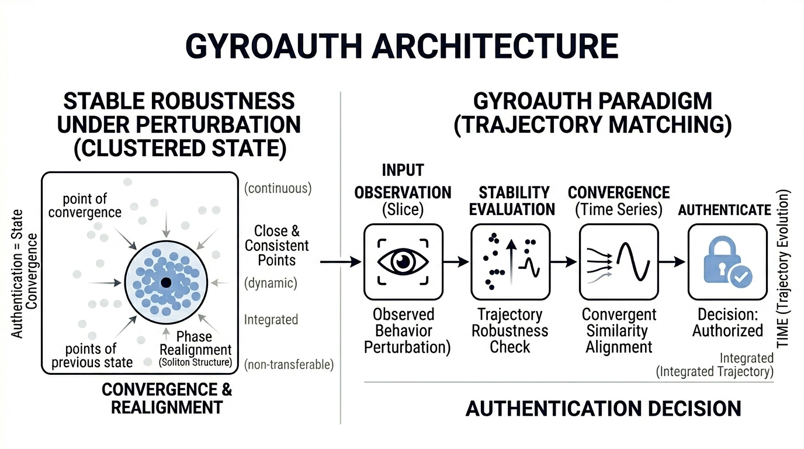

# GyroAuth

**Authentication as State Convergence**

---

## 🧠 What is GyroAuth?

GyroAuth is a novel authentication framework where:

> Authentication is not matching.
> It is convergence.

---

## 🔥 Why it matters

Traditional authentication is static.

GyroAuth is dynamic.



---

## 🧩 Core Concept

> Identity is not a fixed object.
> It is a stable trajectory.



---

## ⚙️ Architecture

GyroAuth transforms behavior into identity through structured observation.



---

## 🚀 How it works

Authentication is a process, not a point.


---

## 🧮 Theoretical Foundation

Stability is defined as robustness under perturbation.


---

## 📡 API

* POST /observe
* GET /stability
* POST /enroll
* POST /authenticate
* POST /reconverge

---

## 🧪 PoC

```bash
pip install -r requirements.txt
uvicorn app.main:app --reload
```

```
http://127.0.0.1:8000/docs
```

---

## 🔗 Relation to Gyro Logic

GyroAuth is built on Gyro Logic:

https://github.com/gitGyro-Dev/gyrologic

---

## 💡 Statement

> Identity is what remains stable through change.

---
