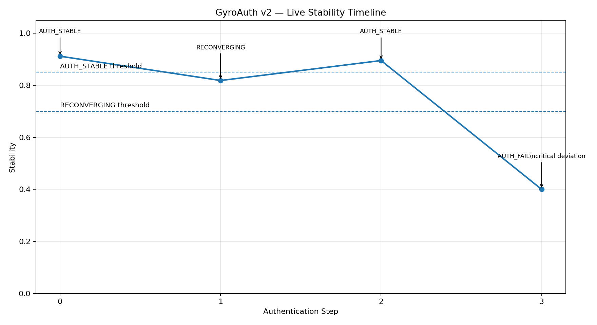

# GyroAuth v2

**ズレの中で成立する「安定性」による認証**

---



---

## 🧭 スタック内の位置

```text
Gyro Logic   = 理論
GyroOS       = 実行基盤
GyroAuth     = 応用（本リポジトリ）
```

- Gyro Logic は **Structure / Slice / Deviation / Stability** を定義  
- GyroOS は **Deviation → Stability → Selection** を計算  
- GyroAuth はそれを用いて **認証判断** を行う  

👉 上位は下位に依存しない  
👉 下位は上位を実装する  
👉 混同は禁止  

---

## 🧠 GyroAuthとは？

GyroAuthは次のような認証システムです：

> 認証とは「一致」ではなく  
> **ズレの中で成立する安定性による選択である**

従来の認証：

```text
入力が一致しているか？
```

GyroAuth：

```text
この状態は、同一の存在として成立しているか？
```

---

## 🔥 なぜ重要か

従来の認証は：

- 完全一致を前提
- 静的なアイデンティティ
- 成功 / 失敗の二値

しかし現実のアイデンティティは：

- ノイズを含む
- 動的である
- 状況依存

GyroAuthは以下を前提に設計されています：

👉 ズレを前提とした本人性  
👉 継続的な認証  
👉 一致ではなく選択  

---

## 🧩 コア定義

```text
認証 = 安定性に基づく選択
```

より正確には：

```text
Auth ⇔ Stability(Δ) に基づく Selection
```

---

## ⚙️ コアフロー

```text
Structure
↓
Slice（観測）
↓
Observation
↓
Δ（ズレ）
↓
Stability（安定性）
↓
Selection（選択）
↓
認証
```

---

## 🧠 マルチスライスモデル

以下の複数観測で評価：

- Space（位置）
- Time（時間）
- Motion（動き）
- Device（端末）
- Behavior（行動）
- Network（通信）

👉 アイデンティティは「点」ではない  
👉 **スライスを横断した軌跡である**

---

## 🔐 認証状態

```text
AUTH_STABLE
RECONVERGING
AUTH_FAIL
```

- AUTH_STABLE：安定  
- RECONVERGING：再収束中  
- AUTH_FAIL：崩壊  

---

## 🔁 継続認証

GyroAuthは一度の認証ではなく：

- 安定性の変化
- スライス間のズレ
- 回復可能性

を継続的に評価します。

---

## 🛡️ セキュリティモデル

対応可能な攻撃：

- リプレイ攻撃
- 資格情報漏洩
- デバイス偽装
- 行動模倣
- エミュレータ

理由：

- 静的情報に依存しない
- 多次元評価
- 時間依存
- 再現不可能

👉 コピーできない認証

---

## 📡 API（概念）

```text
POST /observe
POST /authenticate
POST /reconverge
GET  /session/{id}
```

---

## 🧪 PoC（実動）

```bash
uvicorn app.main:app --reload
```

→ http://127.0.0.1:8000/docs

---

## 📄 ドキュメント

- docs/00_positioning.md
- docs/01_auth_model.md
- docs/03_decision_policy.md
- docs/13_fastapi_poc.md

---

## 🧠 一行定義

GyroAuthとは：

> ズレの中でも成立する状態かどうかで本人性を判断する認証

---

## 🔴 最後に

認証とは「一致」ではない。

👉 **変化の中で成立するかどうかである**
