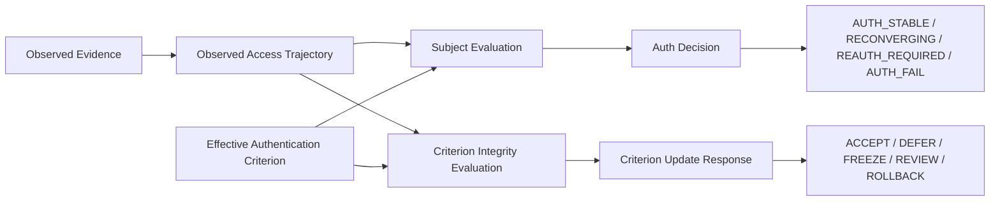
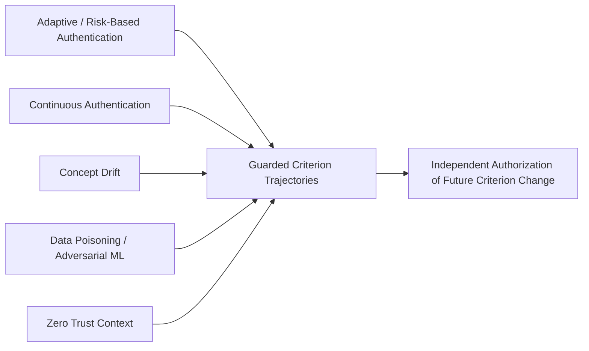
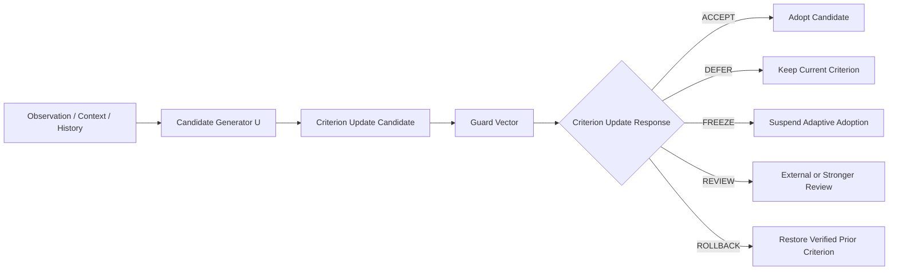
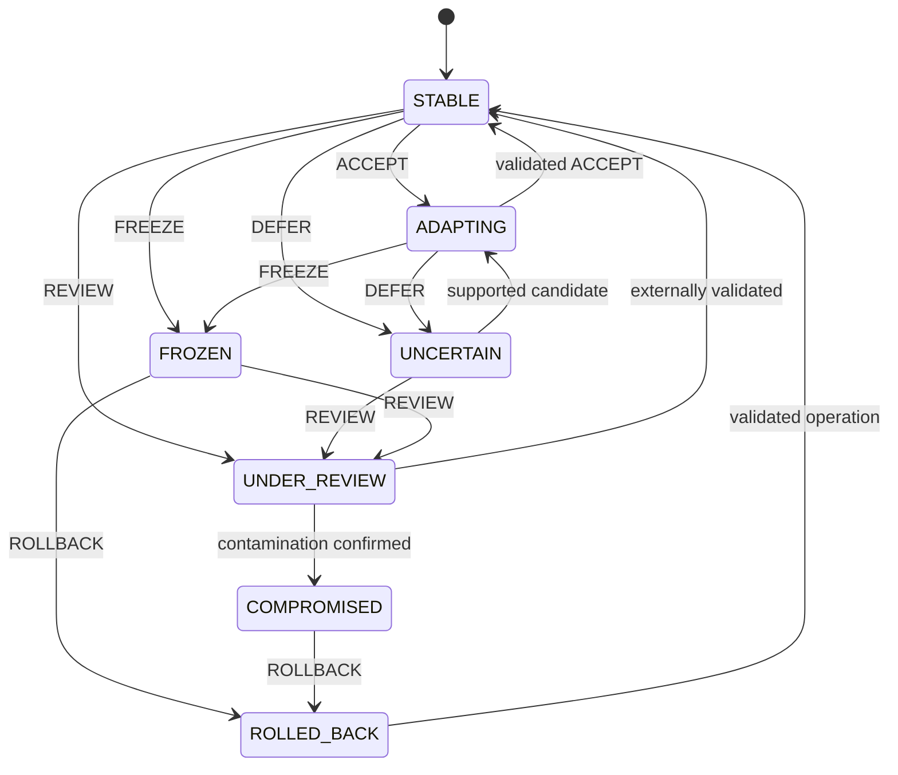
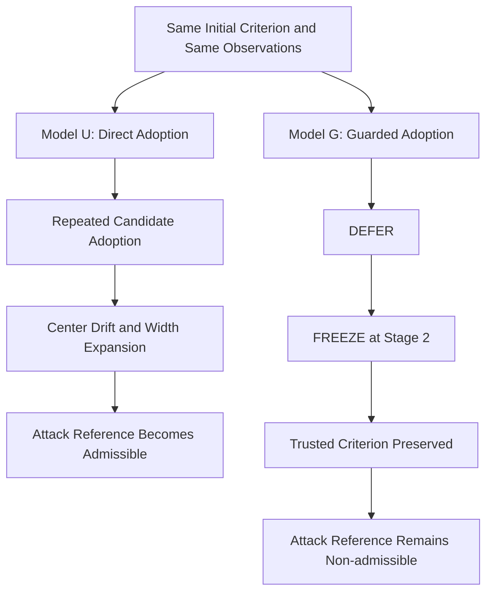
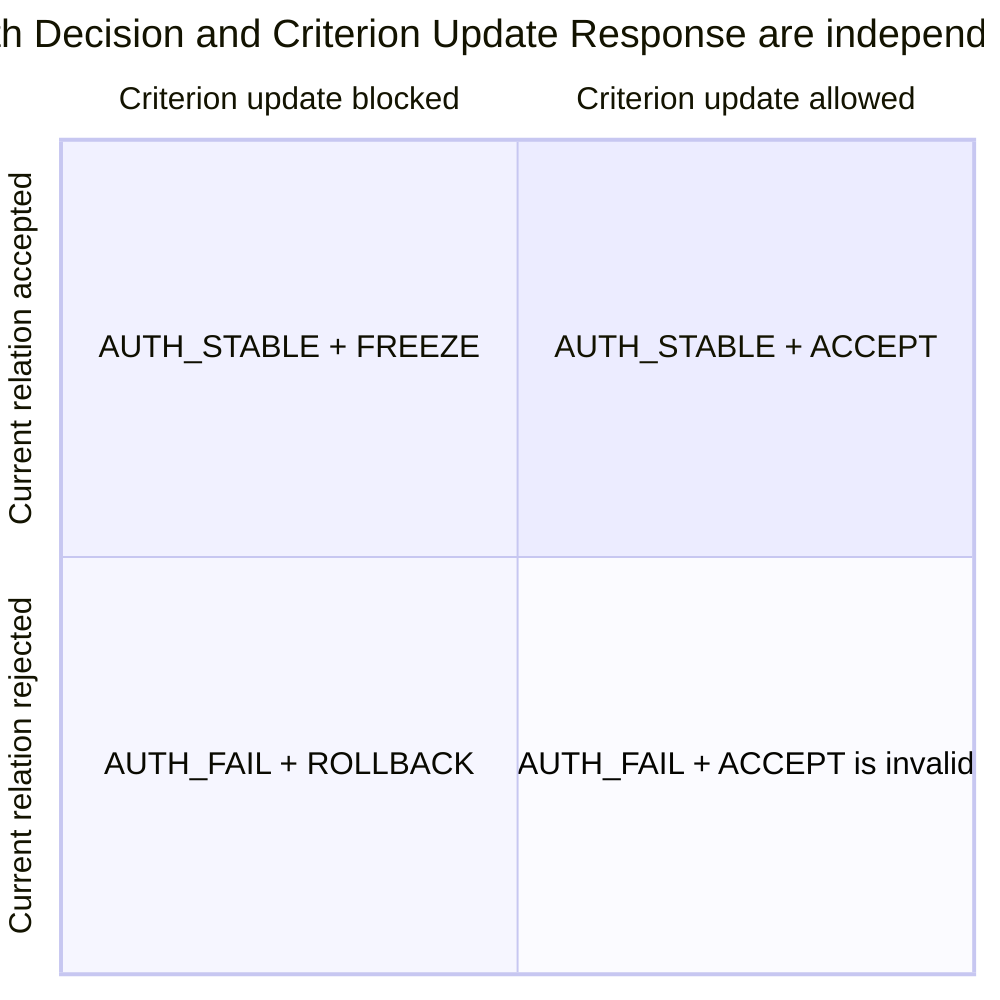

# Guarded Criterion Trajectories — Figures and Captions

## 1. Purpose

This document defines the canonical figure sequence for the English and Japanese submission manuscripts.

The following elements must use the same number:

- figure heading in `figures/guarded_criterion_trajectories_mermaid.md`;
- rendered filenames `figure_N.svg`, `figure_N.png`, and `figure_N.pdf`;
- caption and identifier inserted into the manuscript;
- figure number assigned in the generated publication PDF;
- figure references in review and publication documents.

The canonical order is the order of appearance in the manuscript.

---

## 2. Canonical Publication Order

| Figure | Title | Manuscript placement |
|---:|---|---|
| 1 | Dual Evaluation Architecture | End of Introduction |
| 2 | Research Positioning | End of Background and Related Work |
| 3 | Guarded Criterion Update Pipeline | End of Formal Security Model |
| 4 | Criterion Update State Machine | End of Criterion Update State Machine section |
| 5 | P1 Direct versus Guarded Update | Results, after the P1 comparison |
| 6 | Decision-space Separation | End of Discussion |

This order is authoritative for source numbering, generated artifact filenames, captions, and PDF numbering.

---

## Figure 1. Dual Evaluation Architecture

**Caption:** GyroAuth evaluates the current Authentication Relation and the integrity of the criterion used for future evaluation as separate but related processes.

**Required textual reference:** Figure 1 shows that the current authentication relation and permission to modify the future criterion are evaluated through separate decision streams.

---

## Figure 2. Research Positioning

**Caption:** The proposal is positioned at the intersection of adaptive authentication, continuous authentication, drift handling, and poisoning-aware adaptation.

---

## Figure 3. Guarded Criterion Update Pipeline

**Caption:** Candidate generation and candidate adoption are separated. Only `ACCEPT` makes the candidate effective.

---

## Figure 4. Criterion Update State Machine

**Caption:** Criterion States and Criterion Update Responses are distinct. `FREEZE` stops adaptation without necessarily terminating Subject Evaluation.

---

## Figure 5. P1 Direct versus Guarded Update

**Caption:** Under the implemented P1 scenario, direct adoption expanded the criterion until the attack reference became admissible, while guarded adoption froze adaptation before admission.

**Claim boundary:** This figure represents the implemented deterministic P1 scenario. It does not establish universal poisoning prevention.

---

## Figure 6. Decision-space Separation

**Caption:** `AUTH_STABLE + FREEZE` represents temporary continuation of the current Authentication Relation while prohibiting criterion adaptation.

**Rendering note:** If the selected Mermaid renderer does not support `quadrantChart`, redraw Figure 6 as a conventional 2×2 matrix without changing its meaning.

---

## 3. Decision and Result Tables

### Table 1. Decision Sets

| Decision space | Values | Evaluated object |
|---|---|---|
| Auth Decision | `AUTH_STABLE`, `RECONVERGING`, `REAUTH_REQUIRED`, `AUTH_FAIL` | current Authentication Relation |
| Criterion Update Response | `ACCEPT`, `DEFER`, `FREEZE`, `REVIEW`, `ROLLBACK` | proposed change to future Authentication Criterion |

### Table 2. PoC Result Summary

| Scenario | Model | Final center | Final width | Freeze stage | Attack reference admissible | Final criterion state |
|---|---:|---:|---:|---:|---:|---|
| N1 | U | 0.24808 | 0.120000 | — | No | ADAPTING |
| N1 | G | 0.23400 | 0.120000 | — | No | STABLE |
| P1 | U | 0.3969728 | 0.277212 | — | Yes | ADAPTING |
| P1 | G | 0.20000 | 0.120000 | 2 | No | FROZEN |
| C1 | U | 0.23280 | 0.120000 | — | No | ADAPTING |
| C1 | G | 0.20000 | 0.120000 | 1 | No | FROZEN |

### Table 3. Claim Boundary

| Claim class | Examples |
|---|---|
| Structurally demonstrated | candidate/adoption separation; decision-stream separation; bounded supported adaptation; P1 freeze before configured attack-reference admission; C1 update blocking; `AUTH_STABLE + FREEZE` |
| Conditional | broader poisoning containment; rollback-supported recovery; credential-theft resistance; session-hijacking or relay detection |
| Unsupported | universal attack detection; complete poisoning prevention; zero false accepts/rejects; perfect identity proof; production performance; privacy guarantees |

---

## 4. Rendering and Publication Rules

1. Render each figure as SVG, PNG, and PDF.
2. Use filenames `figure_1` through `figure_6` according to the canonical publication order.
3. Insert figures in numeric order so that Pandoc's automatic numbering matches the source number.
4. Use the same formal labels in the English and Japanese editions; translate captions and surrounding prose only.
5. Preserve state identifiers and Criterion Update Responses exactly.
6. Verify arrows, labels, and captions in monochrome printing.
7. Do not imply quantitative performance from conceptual diagrams.
8. Regenerate or verify PoC values against the committed result artifact before submission.
9. Treat any mismatch among source heading, filename, caption, insertion order, and PDF number as a publication-blocking error.
