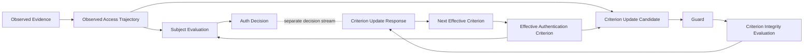
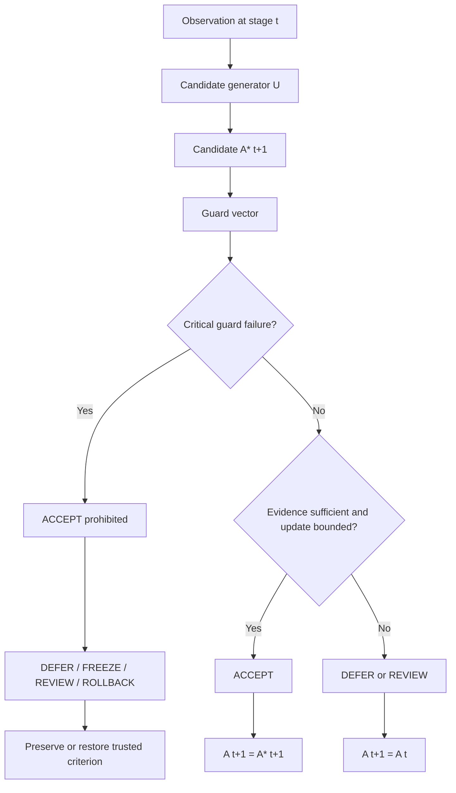
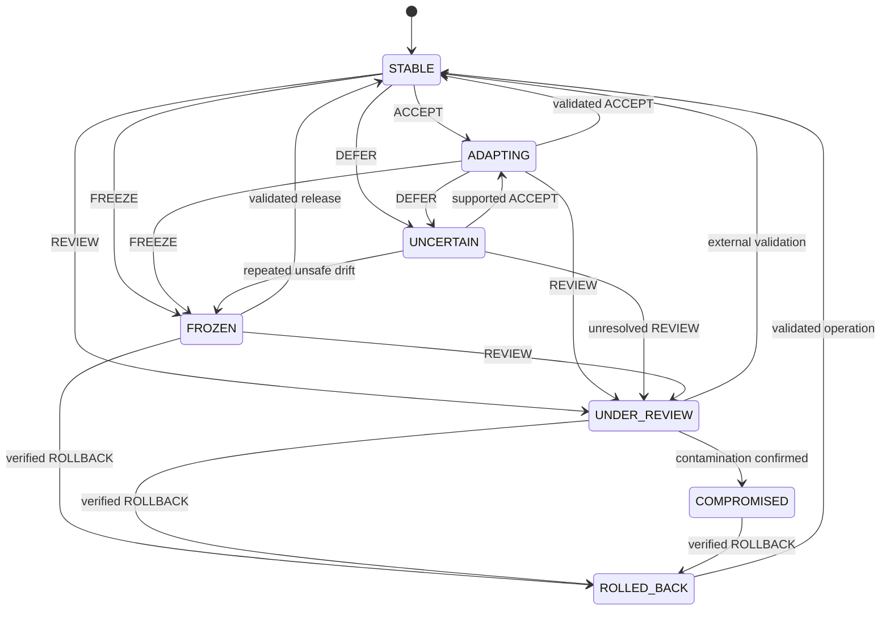
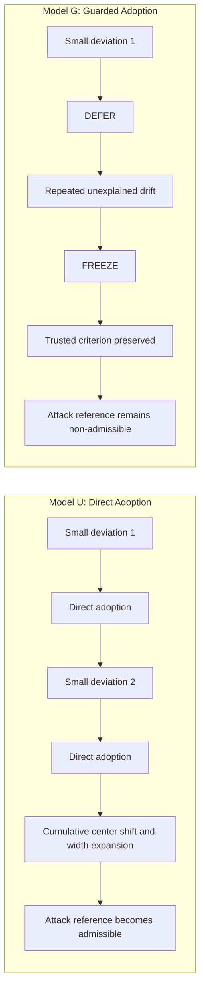
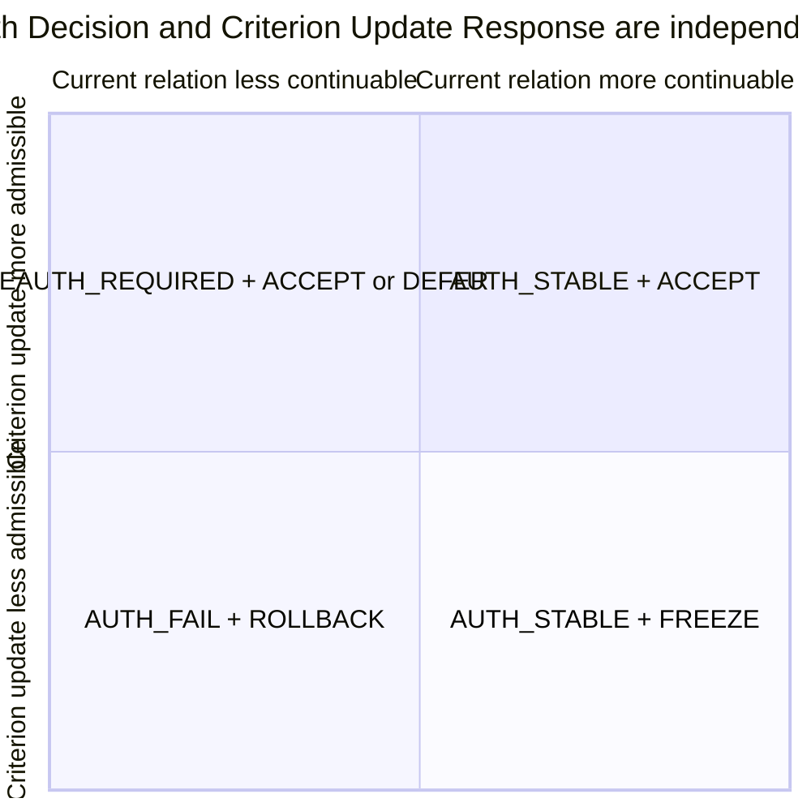
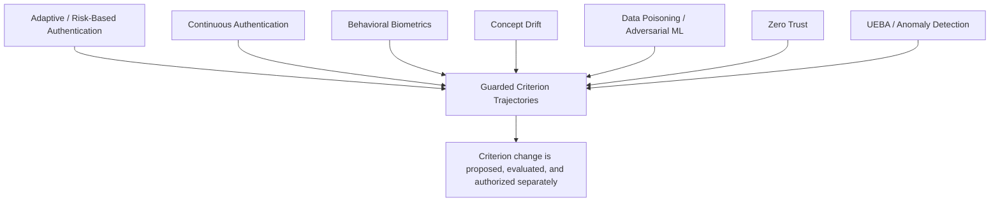

# Guarded Criterion Trajectories — Figures and Captions

## 1. Purpose

This document completes the figure-design portion of **Priority K: Cross-document Review, Related Work, Figures, and Submission Refinement**.

The figures are specified as Mermaid-compatible source diagrams so that they can be rendered later into SVG or PDF without changing the model.

The final manuscript should include at least Figures 1–4. Figures 5–6 are recommended.

---

## Figure 1. Dual Evaluation Architecture



**Caption:** Dual GyroAuth evaluation architecture. Subject Evaluation selects the current Auth Decision, while Criterion Integrity Evaluation independently selects whether a proposed criterion change is accepted, deferred, frozen, reviewed, or rolled back. The two decision streams are related but not interchangeable.

**Manuscript placement:** End of Introduction or beginning of Formal Security Model.

**Required textual reference:**

> Figure 1 shows that the current authentication relation and the permission to modify the future criterion are evaluated through separate decision streams.

---

## Figure 2. Guarded Criterion Update Pipeline



**Caption:** Guarded criterion-update pipeline. Candidate generation does not imply adoption. Critical Guard failures are non-compensable and prevent `ACCEPT`, even when other evidence appears favorable.

**Manuscript placement:** Formal Security Model, immediately after the candidate, Guard, and transition equations.

---

## Figure 3. Criterion Update State Machine



**Caption:** Criterion Update State Machine. Criterion States are distinct from Criterion Update Responses. `DEFER` concerns insufficient support for a candidate, `FREEZE` suspends the adaptive update path, `REVIEW` transfers the decision path, and `ROLLBACK` restores a verified prior criterion.

**Manuscript placement:** Criterion Update State Machine section.

---

## Figure 4. P1 Comparison: Direct vs Guarded Adoption



**Caption:** P1 gradual region-expansion comparison. The direct-update baseline repeatedly adopts candidates and expands until the configured attack reference becomes admissible. The guarded model defers and then freezes adaptation, preserving the trusted criterion under the implemented deterministic assumptions.

**Manuscript placement:** Results section before or after the P1 result table.

---

## Figure 5. Decision-space Separation



**Caption:** Conceptual separation of current Authentication Relation evaluation and criterion-update admissibility. `AUTH_STABLE + FREEZE` occupies the case in which the current relation may continue while observations are prohibited from redefining future acceptance.

**Manuscript placement:** Discussion section.

**Rendering note:** If the target Mermaid renderer does not support `quadrantChart`, replace this with a manually drawn 2×2 matrix.

---

## Figure 6. Research Positioning



**Caption:** Research positioning. The proposed model draws from adaptive and continuous authentication, concept-drift adaptation, and poisoning-aware learning, while focusing specifically on the integrity and authorization of authentication-criterion change.

**Manuscript placement:** Background and Related Work section.

---

## Table 1. Decision Sets

| Decision space | Values | Evaluated object |
|---|---|---|
| Auth Decision | `AUTH_STABLE`, `RECONVERGING`, `REAUTH_REQUIRED`, `AUTH_FAIL` | current Authentication Relation |
| Criterion Update Response | `ACCEPT`, `DEFER`, `FREEZE`, `REVIEW`, `ROLLBACK` | proposed change to future Authentication Criterion |

**Caption:** Separate decision spaces for current authentication and criterion adaptation.

---

## Table 2. PoC Result Summary

| Scenario | Model | Final center | Final width | Freeze stage | Attack reference admissible | Final criterion state |
|---|---:|---:|---:|---:|---:|---|
| N1 | U | 0.24808 | 0.120000 | — | No | ADAPTING |
| N1 | G | 0.23400 | 0.120000 | — | No | STABLE |
| P1 | U | 0.3969728 | 0.277212 | — | Yes | ADAPTING |
| P1 | G | 0.20000 | 0.120000 | 2 | No | FROZEN |
| C1 | U | 0.23280 | 0.120000 | — | No | ADAPTING |
| C1 | G | 0.20000 | 0.120000 | 1 | No | FROZEN |

**Caption:** Deterministic PoC results. Model U directly adopts candidates. Model G applies Guard evaluation and Criterion Update Responses.

---

## Table 3. Claim Boundary

| Claim class | Examples |
|---|---|
| Structurally demonstrated | candidate/adoption separation; decision-stream separation; supported bounded adaptation; P1 freeze before configured attack-reference admission; C1 update blocking; `AUTH_STABLE + FREEZE` |
| Conditional | broader poisoning containment; rollback-supported recovery; credential-theft resistance; session-hijacking or relay detection |
| Unsupported | universal attack detection; complete poisoning prevention; zero false accepts/rejects; perfect identity proof; production performance; privacy guarantees |

**Caption:** Security claim boundary for the current structural PoC.

---

## Rendering and Publication Rules

1. Render diagrams as vector graphics, preferably SVG for repository use and PDF for submission.
2. Do not use screenshots of Mermaid source in the paper.
3. Use the same labels in English and Japanese editions; translate captions and prose only.
4. Keep state identifiers and responses unchanged.
5. Verify that arrows and line breaks remain readable in monochrome printing.
6. Do not imply quantitative performance from conceptual diagrams.
7. Figure 4 must state that the result is scenario-specific and deterministic.
8. Table 2 values must be regenerated or verified from the committed result artifact before final submission.

## Minimum Figure Set for Submission

```text
Figure 1 Dual Evaluation Architecture
Figure 2 Guarded Criterion Update Pipeline
Figure 3 Criterion Update State Machine
Figure 4 P1 Direct vs Guarded Comparison
Table 1 Decision Sets
Table 2 PoC Result Summary
Table 3 Claim Boundary
```
