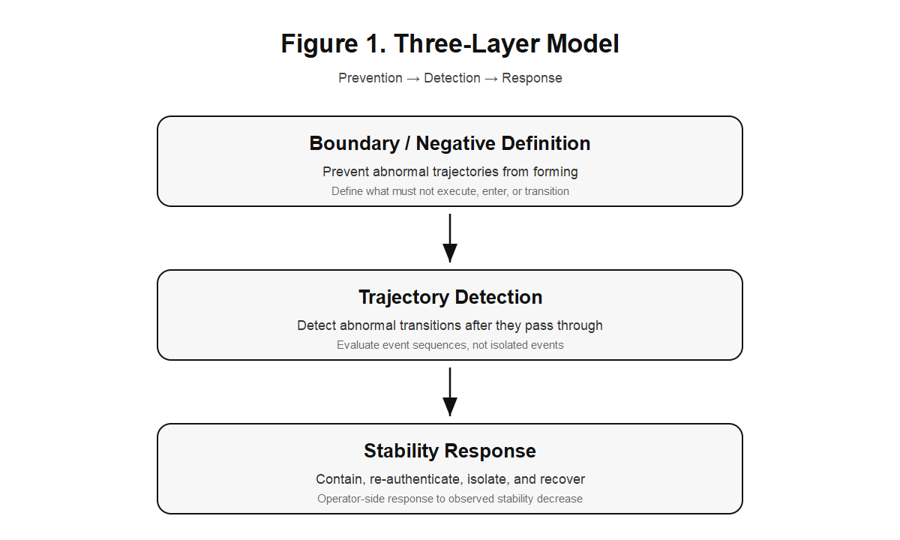
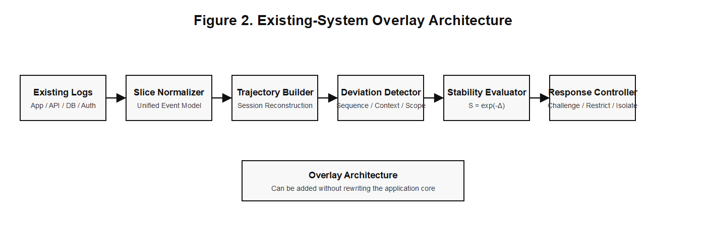
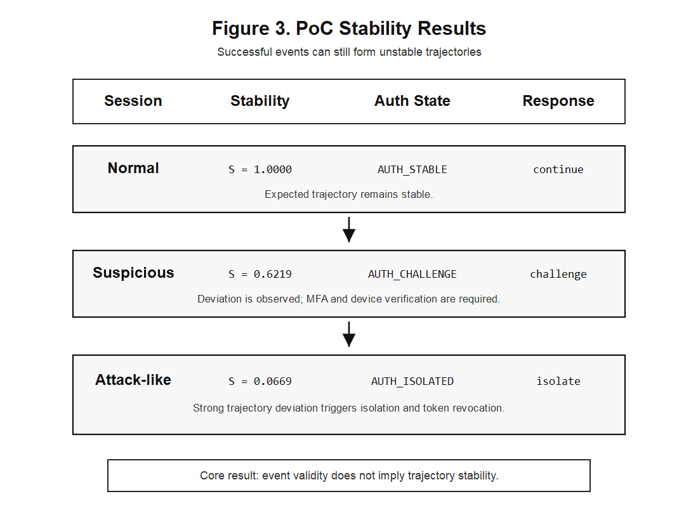

**著者:** 川上俊太郎  
**Author:** Kawakami, Shuntaro  
**所属:** 個人 / Independent Researcher  
**責任著者:** 川上俊太郎 / Kawakami, Shuntaro  
**メールアドレス:** dev.jxiv@gyro-wedge.com  
**Repository:** https://github.com/gitGyro-Dev/gyroauth  
**Applied PoC:** `examples/trajectory_vulnerability_response/`  
**関連GyroAuthプレプリント:** https://doi.org/10.51094/jxiv.4600  
**関連英語版プレプリント:** https://doi.org/10.51094/jxiv.5416  
**本稿について:** 本稿は、英語版プレプリント *Trajectory-Based Vulnerability Response: A GyroAuth Applied Model for Post-Login Security Monitoring* の日本語翻訳版である。

---

## 要旨

AI支援による脆弱性探索が高度化する中で、既知の脆弱性を事前に防止または修正することだけに依存したセキュリティモデルは不十分になる可能性がある。本稿では、ログイン後セキュリティ監視のための GyroAuth 応用モデルとして、Trajectory-Based Vulnerability Response を提案する。本稿の中心的主張は、攻撃が個別には正常で許可されたイベントから構成される場合であっても、その連なりとして本来許容されない不安定な操作Trajectoryを形成し得るという点にある。本モデルでは、脆弱性を「本来許容されないTrajectoryを正常処理として受理してしまう構造的弱点」として捉える。提案モデルは、予防策としての Boundary / Negative Definition、通過後の異常遷移を検知する Trajectory Detection、被害限定・再認証・隔離・回復を行う Stability Response の三層から構成される。最小PoCでは、合成アクセスログからセッションTrajectoryを再構成し、順序、速度、文脈、範囲、量、権限、到達先のDeviationを評価し、重み付きDeviationからStabilityを算出し、段階的Responseへ写像する。本稿は、継続的認証、リスクベース／適応的認証、行動バイオメトリクスと関連するが、主たる対象はユーザー本人性の分類ではなく、正常イベント列によって形成される不安定Trajectoryの検知と応答である。本稿は脆弱性の自動発見や攻撃再現を目的とするものではなく、GyroAuth をログイン時の本人確認から継続的なTrajectory収束監視へ拡張する概念実証である。

**キーワード:** GyroAuth, Gyro Logic, Trajectory検知, 脆弱性対応, ログイン後セキュリティ, Stability Response, 状態収束, サイバーセキュリティ, 認証, 異常検知, 継続的認証, リスクベース認証, 行動バイオメトリクス

---

## 1. はじめに

AIによる脆弱性探索支援能力の向上は、セキュリティ設計に対して新たな課題を提示している。未知の弱点が従来より高速に発見される状況では、すべての脆弱性を事前に発見し修正することだけに依存した防御は十分ではなくなる可能性がある。

これは、予防・パッチ適用・入力検証・アクセス制御が不要であることを意味しない。それらは依然として重要である。しかし現代のシステムには、それに加えて、正常処理経路を通過した後の異常Trajectoryを検知し応答する層が必要になる。

多くの攻撃は、単一の異常イベントとしては現れない。ログインは成功し、APIアクセスは200 OKを返し、ダウンロードも正常に完了する場合がある。問題はイベント単体ではなく、その順序、速度、範囲、文脈、到達先によって形成されるTrajectoryにある。

本稿では、以下の区別を中心に据える。

> イベントの正当性とTrajectoryの安定性は同一ではない。

より短く言えば：

```text
valid events != stable trajectory
```

本稿は、この考えを GyroAuth の応用モデルとして整理する。

---

## 2. GyroAuth の背景

GyroAuth は、Gyro Logic を理論基盤とし、GyroOS に関連して位置づけられる応用レイヤである。その中心定義は以下である。

```text
Authentication = Stability-based Selection over State Convergence
```

GyroAuth フレームワークは Jxiv プレプリントとして公開されている。本稿は、その応用拡張である。GyroAuth が認証を「状態収束に対する安定性に基づく選択」として定義するのに対し、本稿では同じ枠組みをログイン後の脆弱性対応へ応用する。

一般的な認証システムでは、認証は時点的判定として扱われることが多い。ユーザーが資格情報を入力し、トークンが発行され、セッションは認証済みとして扱われる。

GyroAuth はこれを状態過程として扱う。多次元状態が期待されるIdentity Trajectoryへ収束しているかを観測し、その安定性、Deviation、Operator Response、履歴に基づいて認証状態を選択する。

本稿では、この考えをログイン時の本人確認から、ログイン後セッションのTrajectory監視へ拡張する。

問題は単に「このユーザーは認証済みか？」ではなく、「このログイン後セッションTrajectoryは、期待されるIdentity・権限・業務文脈の中で安定しているか？」である。

本稿は Gyro Logic の再定義ではなく、GyroAuth の応用ノートである。

---

## 3. 先行研究と本稿の位置づけ

本稿は、継続的認証、リスクベース認証、適応的認証、行動バイオメトリクス、Zero Trust Architecture、および運用上のセキュリティ監視と関連する。これらは、本稿の技術的位置づけを明確にするうえで重要である。

継続的認証は、ログイン時点のみの認証の限界に対して、セッション中も継続的にユーザー本人性を確認する考え方である。既存研究では、タッチ操作、キーストローク、歩行、端末の動き、音声、アプリ利用パターンなどの行動特徴やセンサー情報を用いて、ユーザーを暗黙的かつ継続的に検証する手法が検討されてきた。

リスクベース認証および適応的認証は、すべてのアクセスに同一の認証要求を課すのではなく、端末、位置、ネットワーク、時刻、利用パターンなどの文脈情報からリスクを評価し、リスクが高い場合に追加認証を要求する。これらは、漏えいパスワード、credential stuffing、不審なログイン試行などへの実務的対策として重要である。

行動バイオメトリクス、継続的認証、リスクベース認証は、いずれも認証を静的な一致判定から拡張する点で GyroAuth と近い。しかし、本稿の焦点は異なる。本稿は、新しい行動バイオメトリクス分類器を提案するものではなく、本人性判定の equal error rate を評価するものでもない。また、ログインまたは単一トランザクションのリスクスコアを計算して追加認証を発火させることだけを目的とするものでもない。

本稿の対象は、ログイン後に発生する操作列をTrajectoryとして扱い、そのTrajectoryが Identity、権限、resource、volume、destination、operational context の中で安定しているかを評価することである。したがって、本稿は継続的認証やリスクベース認証を置き換えるものではなく、それらと補完関係にある。

一般的な異常検知や SIEM 型監視とも関連するが、本稿の焦点はイベント単体の異常ではなく、個別には正常なイベント列が本来許容されないTrajectoryを形成する点にある。

> Individually valid events may compose an impermissible trajectory.

本稿の新規性は、継続的監視の有用性そのものを主張することではない。それは既存研究および実務で広く認識されている。本稿の新規性は、GyroAuth の枠組みに基づいて、脆弱性対応をTrajectory安定性の評価として定式化する点にある。すなわち、脆弱性を「本来許容されないTrajectoryを正常処理として受理してしまう構造的弱点」と捉え、イベント単体の正当性ではなく、Trajectory全体のStabilityとDeviationに基づいて段階的Responseへ接続する点に本稿の位置づけがある。

---

## 4. 本来許容されないTrajectoryとしての脆弱性

脆弱性は一般に、ソフトウェア・設定・設計・運用における弱点として説明される。本モデルでは、これをTrajectoryの観点から次のように定義する。

> 脆弱性とは、本来許容されないTrajectoryを正常処理として受理してしまう構造的弱点である。

ここで重要なのは、脆弱性が単なるバグではないという点である。バグは期待された動作の失敗である。一方、脆弱性は、セキュリティ境界・状態遷移制約・運用前提を保持できないことにある。

例として以下がある。

- データが実行コマンド空間へ侵入する
- 未認証状態が認証Trajectoryへ侵入する
- 一般ユーザーTrajectoryが管理Trajectoryへ侵入する
- resource境界を越えて他者データへ到達する
- 異常なデータ移動後もセッションが通常継続する

したがって GyroAuth 的には、イベントが許可されたかだけではなく、その結果形成されるTrajectoryが安定しているかを見る必要がある。

---

## 5. 正常イベントによって形成される不安定Trajectoryとしての攻撃

攻撃は必ずしも単一の異常イベントとして現れない。実際には、攻撃者は正常操作を異常順序で並べる場合が多い。

例えば：

```text
login
-> api_access
-> bulk_download
-> external_transfer
```

各イベントは成功している可能性がある。ログインは有効であり、APIは到達可能であり、ダウンロード機能も存在し、外部送信も許可されたendpoint経由かもしれない。しかしTrajectory全体としては、本来許容されない。

セッションTrajectoryを以下で定義する。

$$
T_s = (e_1, e_2, \ldots, e_n)
$$

ここで `e_i` は session `s` に属するイベントである。

イベント単体では正当性が成立し得る。

$$
\forall e_i \in T_s,\ \mathrm{allow}(e_i)=\mathrm{true}
$$

しかしTrajectoryの安定性は崩壊し得る。

$$
\mathrm{Stable}(T_s \mid C_s) < \theta
$$

ここで `C_s` は user, role, device, time, location, resource, history を含む文脈である。

本稿の中心主張は以下である。

> すべてのイベントが許可されていても、Trajectory全体は本来許容されない場合がある。

---

## 6. 三層モデル

提案モデルは、Figure 1 に示す三層から構成される。

{width=90%}

Trajectory-Based Vulnerability Response は以下の三層で構成される。

```text
Boundary / Negative Definition
Trajectory Detection
Stability Response
```

これは予防・検知・応答に対応する。

---

### 6.1 Boundary / Negative Definition

Boundary / Negative Definition は予防層である。

セキュリティ設計は、「何を実行するか」の定義だけでは不十分である。

以下も定義する必要がある。

- 何を実行してはならないか
- どの状態遷移を許容しないか
- どの入力を command space に入れてはならないか
- どの role が resource 境界を越えてはならないか
- どの不安定状態が critical operation に入ってはならないか

Boundary / Negative Definition は、この意味で異常Trajectoryが形成される空間を狭める。

---

### 6.2 Trajectory Detection

Trajectory Detection は通過後検知層である。

どの境界も完全ではないため、一部の異常Trajectoryは通常制御を通過し得る。Trajectory Detection はログからイベント列を再構成し、期待される文脈の中で安定しているかを評価する。

主なDeviationは以下である。

- sequence deviation
- velocity deviation
- context deviation
- scope deviation
- volume deviation
- permission deviation
- destination deviation

検知対象はイベント単体ではなくイベント列である。

```text
Detection target = trajectory, not isolated event
```

この層は、既存のセキュリティ監視実務と接続可能である。ただし本稿では、イベント単体の正当性ではなく、Trajectory全体の安定性に焦点を置く。

---

### 6.3 Stability Response

Stability Response は応答層である。

検知だけでは防御にならない。Trajectory Deviation が観測されたとき、検知結果を段階的制御へ接続する必要がある。

応答例は以下である。

- continue
- observe
- challenge
- restrict
- isolate
- recover

ここで重要なのは、Stability 自体が判断主体ではない点である。Stability は観測される状態変数であり、Operator-side response function が Stability と Deviation をもとに応答を選択する。

$$
R = \rho(S,\Delta,C)
$$

---

## 7. 既存システムへの後付けアーキテクチャ

提案モデルの後付け構成を Figure 2 に示す。既存システムから出力されるログやイベントを Slice として正規化し、それらをセッション単位のTrajectoryとして再構成する。その後、Deviationを検出し、Stabilityを評価し、必要に応じて Response Controller が既存の制御点へ応答を返す。

{width=95%}

提案モデルは、既存システムを書き換えずに追加可能である。最小構造は以下である。

```text
Existing Logs
-> Slice Normalizer
-> Trajectory Builder
-> Stability Evaluator
-> Deviation Detector
-> Response Controller
```

システムはまず既存環境からログ・イベントを収集する。対象には application logs, API gateway logs, authentication logs, authorization logs, database audit logs, file access logs, session logs などが含まれる。

Slice Normalizer はこれらを共通イベント形式へ変換する。

Trajectory Builder は session, user, device, resource, time window ごとにTrajectoryを構築する。

Stability Evaluator は通常Trajectoryとの差分を評価する。

Response Controller は IAM, MFA, API Gateway, rate limiter, SIEM, SOAR, session manager などの既存制御点を用いて応答する。

---

## 8. PoC

最小PoCは以下に実装されている。

```text
examples/trajectory_vulnerability_response/
```

PoCは synthetic JSONL access logs を用い、以下の三種類のセッションを含む。

1. normal session
2. suspicious session
3. attack-like session

PoCは以下の流れを実装する。

```text
Logs -> Slice -> Trajectory -> Deviation -> Stability -> Response
```

---

### 8.1 シナリオ

正常セッション：

```text
login -> view_dashboard -> search -> view_record -> logout
```

疑わしいセッション：

```text
login -> api_access -> export
```

攻撃的セッション：

```text
login -> api_access -> bulk_download -> external_transfer
```

すべてのイベントは `success` として記録される。これは意図的である。本PoCは、「正常に成功したイベント列」が不安定Trajectoryを形成し得ることを示す。

---

### 8.2 Stability 計算

PoCでは、以下のDeviationを評価する。

- sequence
- velocity
- context
- scope
- volume
- permission
- destination

重み付きDeviationを以下で計算する。

$$
\Delta(T_s)
=
w_{\mathrm{seq}}\Delta_{\mathrm{seq}}
+
w_{\mathrm{vel}}\Delta_{\mathrm{vel}}
+
w_{\mathrm{ctx}}\Delta_{\mathrm{ctx}}
+
w_{\mathrm{scope}}\Delta_{\mathrm{scope}}
+
w_{\mathrm{vol}}\Delta_{\mathrm{vol}}
+
w_{\mathrm{perm}}\Delta_{\mathrm{perm}}
+
w_{\mathrm{dest}}\Delta_{\mathrm{dest}}
$$

Stability は以下で計算する。

$$
S(T_s)=\exp(-\Delta(T_s))
$$

これは PoC 用の実装モデルであり、Gyro Logic 本体の再定義ではない。

---

### 8.3 Response Mapping

PoCは Stability を段階的応答へ写像する。

| Stability | Auth State | Response |
|---:|---|---|
| S >= 0.85 | AUTH_STABLE | continue |
| S >= 0.65 | RECONVERGING | observe |
| S >= 0.45 | AUTH_CHALLENGE | challenge |
| S >= 0.25 | AUTH_RESTRICTED | restrict |
| S < 0.25 | AUTH_ISOLATED | isolate |

---

### 8.4 結果

{width=90%}

Figure 3 は、PoCにおける各セッションのStability結果を示す。正常セッションでは Stability が 1.0000 に保たれ、AUTH_STABLE / continue が選択された。一方、疑わしいセッションでは Stability が 0.6219 まで低下し、AUTH_CHALLENGE / challenge が選択された。攻撃的セッションでは Stability が 0.0669 まで低下し、AUTH_ISOLATED / isolate が選択された。

PoCは以下の結果を生成した。

| Session | Delta | Stability | Auth State | Response |
|---|---:|---:|---|---|
| normal | 0.000 | 1.0000 | AUTH_STABLE | continue |
| suspicious | 0.475 | 0.6219 | AUTH_CHALLENGE | challenge |
| attack-like | 2.705 | 0.0669 | AUTH_ISOLATED | isolate |

正常セッションは安定状態を維持した。疑わしいセッションは MFA と device verification を伴う challenge を要求した。攻撃的セッションは session isolation, token revocation, external transfer blocking, audit log preservation, administrator notification を含む isolate 応答を返した。

これは本PoCの中心主張を示している。

> 正常に成功したイベントでも、不安定Trajectoryを形成し得る。

---

## 9. 議論

本モデルは continuous authentication, risk-based authentication, adaptive authentication, behavioral biometrics, intrusion detection, SIEM, EDR, UEBA, Zero Trust Architecture, threat-modeling frameworks など既存監視概念と近い目的を持つ。しかし本稿の焦点は異なる。本モデルはイベント単体を normal / abnormal に分類するだけでなく、イベント列をTrajectoryとして再構成し、それが Identity, permission, resource, operational context の中で安定しているかを見る。

継続的認証および行動バイオメトリクスと比較すると、本モデルは、現在の操作主体が本人であるかを生体的・行動的特徴から分類することを主目的としない。リスクベース認証と比較すると、ログインまたは単一トランザクションのリスクスコアを算出して追加認証を行うだけではない。一般的な異常検知と比較すると、異常性を単一イベントの属性としてのみ扱わない。本稿は、個別には正常なイベント列が安定Trajectoryを形成しているか、あるいは本来許容されないTrajectoryを形成しているかを評価する。

また、本モデルは既存システムと共存可能である。ログベース監視から始め、alerting, step-up authentication, dynamic restriction, session isolation へ段階的に発展できる。この整理は、予防・検知・応答・回復を相互補完的な機能として扱う既存のサイバーセキュリティ実務とも整合する。

Deviation は必ずしも攻撃を意味しない。ユーザーは移動し、新端末を利用し、大量業務を行う場合がある。したがって Stability Response は即時遮断ではなく、段階的 Operator-side response である必要がある。

---

## 10. 倫理的・セキュリティ上の考慮

本稿は、攻撃コード、脆弱性発見手順、実運用環境への攻撃方法を提示するものではない。PoCは合成ログのみを用い、ログイン後Trajectory監視と段階的Responseの概念実証を目的とする。

提案モデルは、補完的な監視・応答層として理解されるべきである。secure coding、patch management、access control、vulnerability management、incident response、既存のセキュリティツールを置き換えるものではない。

---

## 11. 制限事項

本稿は概念モデルおよび最小PoCであり、以下の制限を持つ。

- synthetic logs を用いている
- 実データセット評価を行っていない
- threshold および weight は例示的である
- production IDS claim を行わない
- false positive 調整が必要である
- 応答には実システムとの統合が必要である
- patching, secure coding, access control, existing security tools を置き換えるものではない

本PoCの目的は exploit を再現することではない。正常イベント列から不安定Trajectoryを検知し、段階的Responseへ接続できることを示す点にある。

---

## 12. 結論

本稿では、Trajectory-Based Vulnerability Response を GyroAuth の応用モデルとして提案した。本モデルは、脆弱性悪用が個別には正常なイベントから構成されながら、本来許容されないTrajectoryを形成し得るという観察から出発する。

提案モデルは以下の三層から構成される。

```text
Boundary / Negative Definition = prevention
Trajectory Detection = post-entry abnormal transition detection
Stability Response = containment, re-authentication, isolation, and recovery
```

最小PoCは、正常に成功したイベント列を session trajectory として再構成し、Deviation を Stability に変換し、段階的Responseへ接続可能であることを示した。

本稿の中心結論は以下である。

> イベントの正当性とTrajectoryの安定性は同一ではない。

AI支援による脆弱性探索と複雑化するシステム環境において、脆弱性対応はイベント単体の許可可否だけではなく、そのイベント列が形成するTrajectory全体の安定性を評価する必要がある。

---

## AI支援ツールの使用

本稿の作成にあたり、構成整理、草稿作成補助、表現調整、整合性確認のためにAI支援ツールを使用した。本文の内容、主張、参考文献、最終原稿については著者が確認・編集し、全責任を負う。

---

## 利益相反

著者は、本稿に関して開示すべき利益相反はない。

---

## 参考文献

1. 川上俊太郎, *Trajectory-Based Vulnerability Response: A GyroAuth Applied Model for Post-Login Security Monitoring*, Jxiv, https://doi.org/10.51094/jxiv.5416
2. 川上俊太郎, *Gyro Logic: A Stability-Based Framework for Representation Under Intrinsic Deviation*, Jxiv, https://doi.org/10.51094/jxiv.4159
3. 川上俊太郎, *Gyro Logic: A Stability-Based Framework for Representation Under Intrinsic Deviation* 日本語翻訳版, Jxiv, https://doi.org/10.51094/jxiv.4597
4. 川上俊太郎, *GyroAuth: Stability-Based Authentication over State Convergence*, Jxiv, https://doi.org/10.51094/jxiv.4600
5. 川上俊太郎, *GyroAuth: Stability-Based Authentication over State Convergence* 日本語翻訳版, Jxiv, https://doi.org/10.51094/jxiv.5341
6. GyroAuth GitHub repository, https://github.com/gitGyro-Dev/gyroauth
7. Trajectory-Based Vulnerability Response PoC, https://github.com/gitGyro-Dev/gyroauth/tree/main/examples/trajectory_vulnerability_response
8. National Institute of Standards and Technology, *The NIST Cybersecurity Framework (CSF) 2.0*, NIST Cybersecurity White Paper 29, 2024, https://doi.org/10.6028/NIST.CSWP.29
9. Rose, S., Borchert, O., Mitchell, S., and Connelly, S., *Zero Trust Architecture*, NIST Special Publication 800-207, 2020, https://doi.org/10.6028/NIST.SP.800-207
10. OWASP Foundation, *OWASP Top 10:2021*, https://owasp.org/Top10/
11. MITRE, *MITRE ATT&CK*, https://attack.mitre.org/
12. Patel, V. M., Chellappa, R., Chandra, D., and Barbello, B., *Continuous User Authentication on Mobile Devices: Recent progress and remaining challenges*, IEEE Signal Processing Magazine, 33(4), 49-61, 2016, https://doi.org/10.1109/MSP.2016.2555335
13. Mahfouz, A., Mahmoud, T. M., and Sharaf Eldin, A., *A Survey on Behavioral Biometric Authentication on Smartphones*, Journal of Information Security and Applications, 37, 28-37, 2017, https://doi.org/10.1016/j.jisa.2017.10.002
14. Abuhamad, M., Abusnaina, A., Nyang, D., and Mohaisen, D., *Sensor-Based Continuous Authentication of Smartphones' Users Using Behavioral Biometrics: A Contemporary Survey*, IEEE Internet of Things Journal, 8(1), 65-84, 2021, https://doi.org/10.1109/JIOT.2020.3020076
15. Wiefling, S., Lo Iacono, L., and Dürmuth, M., *Is This Really You? An Empirical Study on Risk-Based Authentication Applied in the Wild*, IFIP Advances in Information and Communication Technology, 580, 134-148, 2020, https://doi.org/10.1007/978-3-030-58201-2_9
