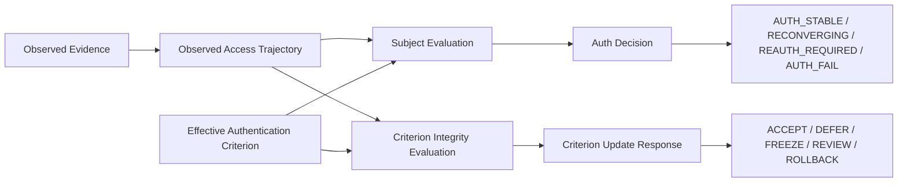
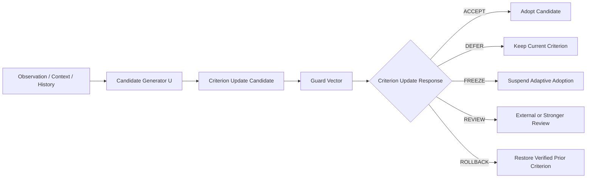
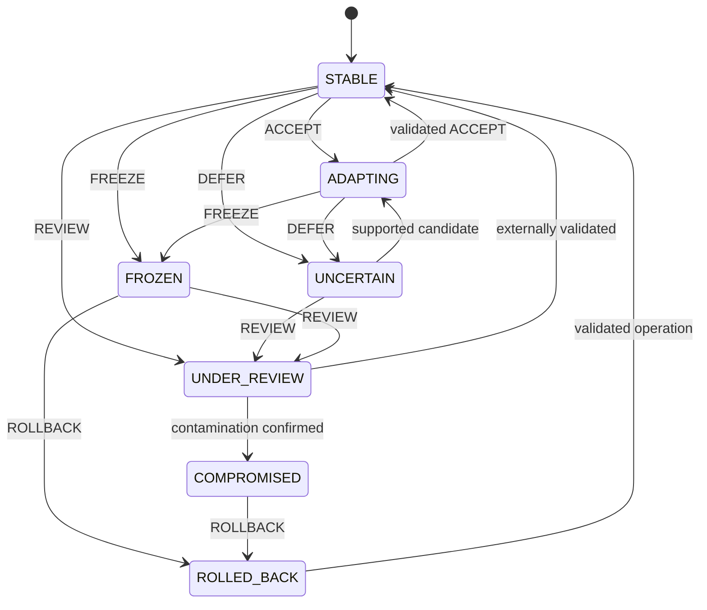
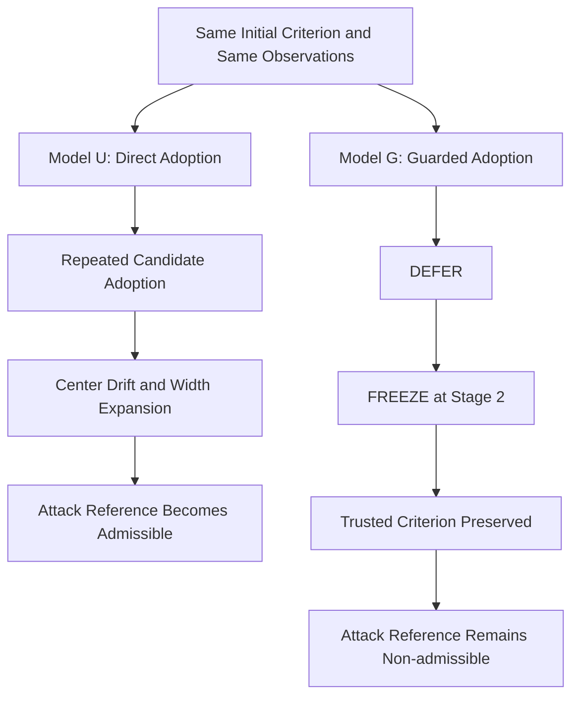
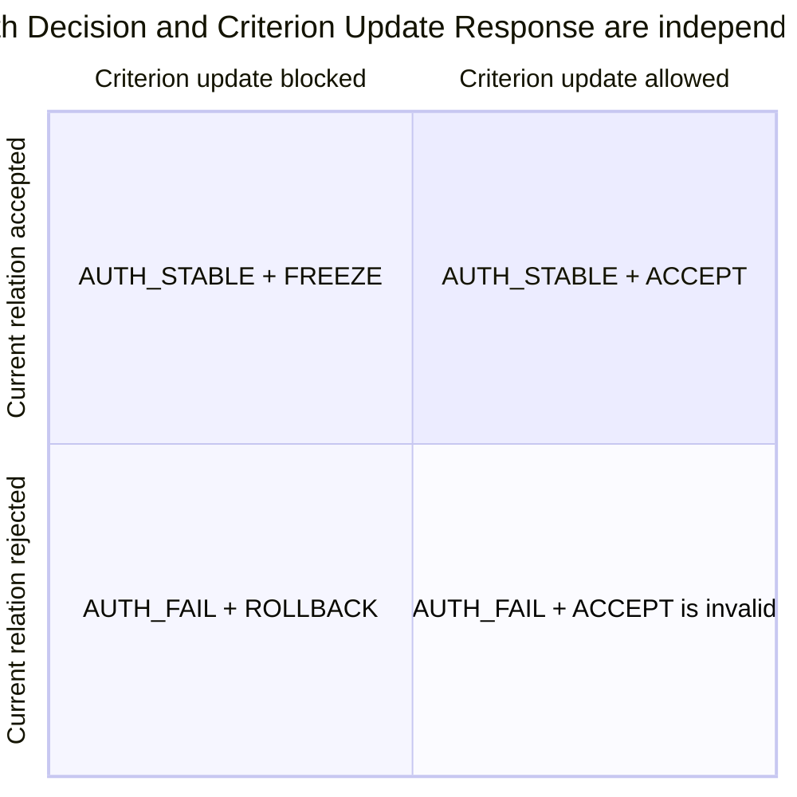
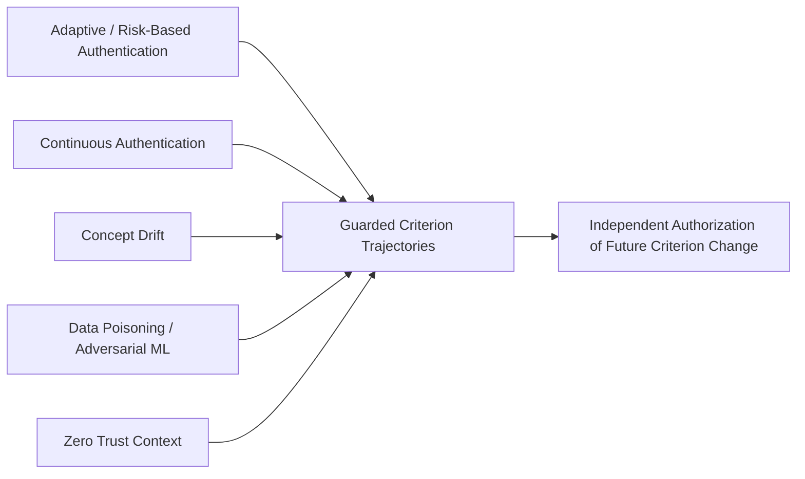

# Guarded Criterion Trajectories — Figure Sources

This file contains editable Mermaid sources for the submission manuscript.

## Figure 1. Dual Evaluation Architecture

**Caption:** GyroAuth evaluates the current Authentication Relation and the integrity of the criterion used for future evaluation as separate but related processes.

## Figure 2. Guarded Criterion Update Pipeline

**Caption:** Candidate generation and candidate adoption are separated. Only `ACCEPT` makes the candidate effective.

## Figure 3. Criterion Update State Machine

**Caption:** Criterion States and Criterion Update Responses are distinct. `FREEZE` stops adaptation without necessarily terminating Subject Evaluation.

## Figure 4. P1 Direct versus Guarded Update

**Caption:** Under the implemented P1 scenario, direct adoption expanded the criterion until the attack reference became admissible, while guarded adoption froze adaptation before admission.

## Figure 5. Decision-space Separation

**Caption:** `AUTH_STABLE + FREEZE` represents temporary continuation of the current Authentication Relation while prohibiting criterion adaptation.

## Figure 6. Research Positioning

**Caption:** The proposal is positioned at the intersection of adaptive authentication, continuous authentication, drift handling, and poisoning-aware adaptation.

## Rendering Notes

For publication:

1. render each figure to SVG and PDF;
2. use consistent typography with the manuscript;
3. preserve monochrome readability;
4. ensure line and label sizes remain legible at single-column width;
5. replace Mermaid-specific styling if required by the submission venue;
6. verify that Figure 5 is supported by the selected Mermaid renderer; if not, redraw it as a conventional 2×2 matrix.
