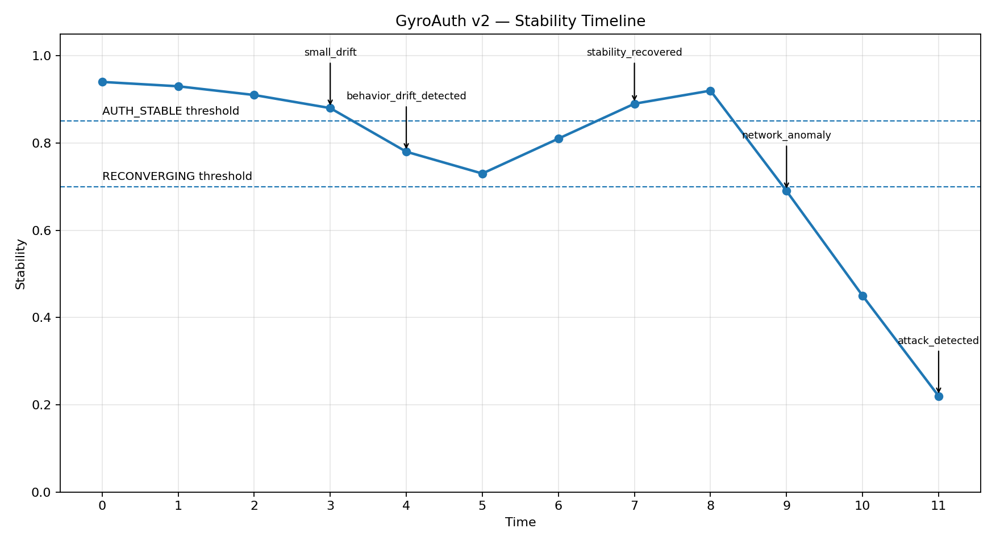

# GyroAuth v2 — Stability Demo

---

## 🧭 Purpose

This demo visualizes the core concept of GyroAuth:

> Authentication is not exact matching.  
> It is whether identity still holds under change.

---

## ■ What This Demo Shows

This script generates a full authentication story:

AUTH_STABLE
→ small drift
→ RECONVERGING
→ recovery
→ AUTH_STABLE
→ attack
→ AUTH_FAIL

---

## ■ How to Run

python scripts/demo_stability_graph.py

---

## ■ Output Files

outputs/
├─ demo_stability_data.csv
├─ stability_timeline.png
└─ slice_breakdown.png

---

## ■ Stability Timeline

This graph shows identity as a function of time.

### Meaning

- Flat line → stable identity  
- Small fluctuation → acceptable deviation  
- Downward trend → drift  
- Sharp drop → attack  
- Recovery → re-convergence  

👉 This is the core visualization of GyroAuth

---

## ■ Slice Breakdown

This graph shows:

- which slice failed  
- why stability collapsed  

Example slices:

- Device  
- Behavior  
- Time  
- Space  
- Network  
- Motion  

---

## ■ Why This Matters

Traditional authentication:

Match → Success / Fail

GyroAuth:

Stability over time → Decision

---

## ■ Connection to FastAPI PoC

This visualization corresponds directly to the running API:

/observe        → adds observation  
/authenticate   → produces AUTH state  
/session        → shows history  

### Mapping

Graph Stability → API stability field  
Graph State change → auth_state  
Graph drop → AUTH_FAIL  
Graph recovery → RECONVERGING → AUTH_STABLE  

👉 This graph is NOT a simulation.  
👉 It is a visualization of the actual authentication model.

---

## ■ Demo Value

This demo proves:

- Authentication works under deviation  
- Identity can recover  
- Attacks break stability  
- Authentication is continuous  

---

## ■ Use Cases

- Investor demo  
- Product explanation  
- README visualization  
- Presentation slides  
- X / social content  

---

## ■ Recommended Next Step

- Connect this graph to FastAPI live data  
- Integrate into UI dashboard  
- Stream stability in real time  

---

## ■ Key Insight

Identity is not a fixed value.  
It is a stable trajectory.

---

## 🔴 Final Statement

If identity cannot be visualized,  
it cannot be understood.
